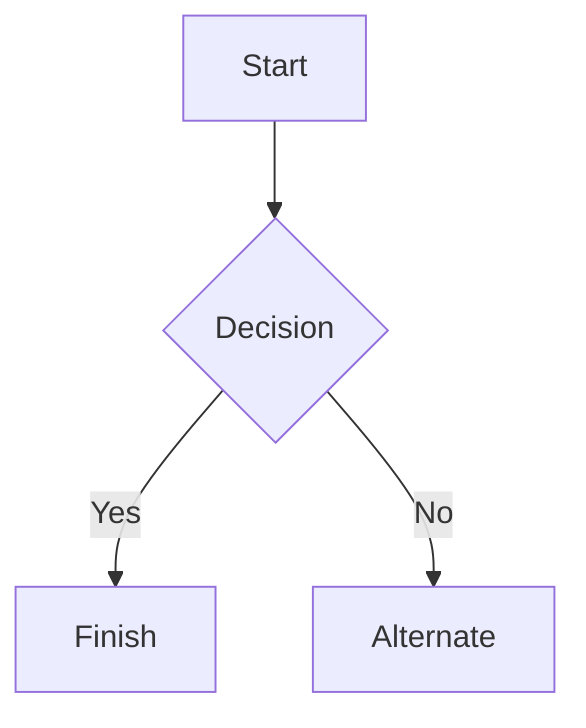

# Markdown syntax guide

## Headers

# This is a Heading h1

## This is a Heading h2

###### This is a Heading h6

## Emphasis

_This text will be italic_  
_This will also be italic_

**This text will be bold**  
**This will also be bold**

_You **can** combine them_

## Lists

### Unordered

- Item 1
- Item 2
- Item 2a
- Item 2b
  - Item 3a
  - Item 3b

### Ordered

1. Item 1
2. Item 2
3. Item 3
   1. Item 3a
   2. Item 3b

## Images


## Links

This is a link: [Gustavo](https://github.com/hsm-gustavo).

## Blockquotes

> Markdown is a lightweight markup language with plain-text-formatting syntax, created in 2004 by John Gruber with Aaron Swartz.
>
> > Markdown is often used to format readme files, for writing messages in online discussion forums, and to create rich text using a plain text editor.

## Tables

| Left columns | Right columns |
| ------------ | :-----------: |
| left foo     |   right foo   |
| left bar     |   right bar   |
| left baz     |   right baz   |

## Blocks of code

```
let message = 'Hello world';
alert(message);
```

## Mermaid diagrams



## Inline code

Some sample text `this is an inline code`.
